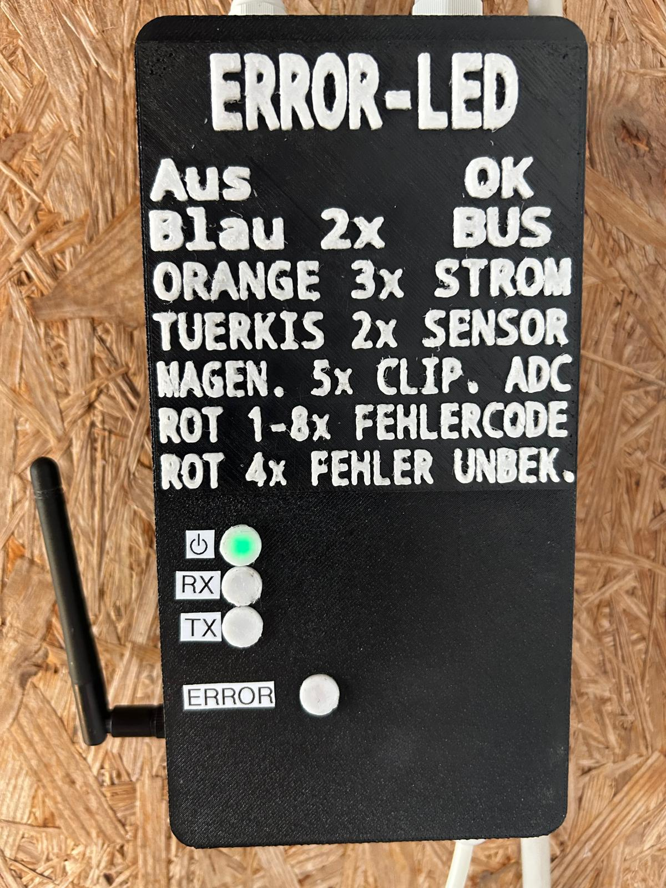
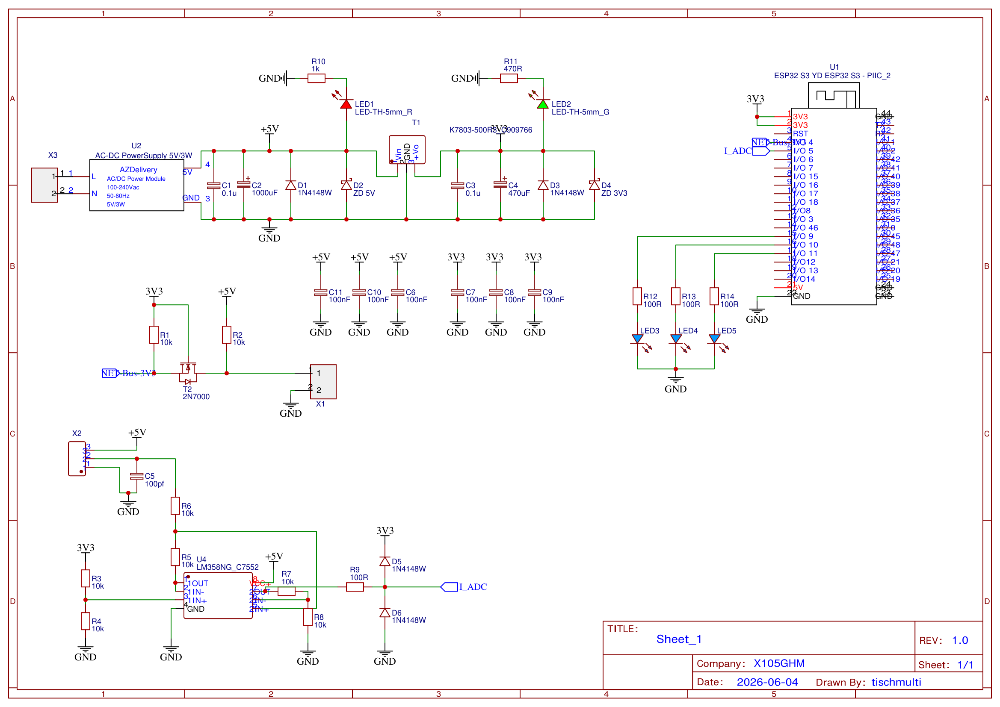
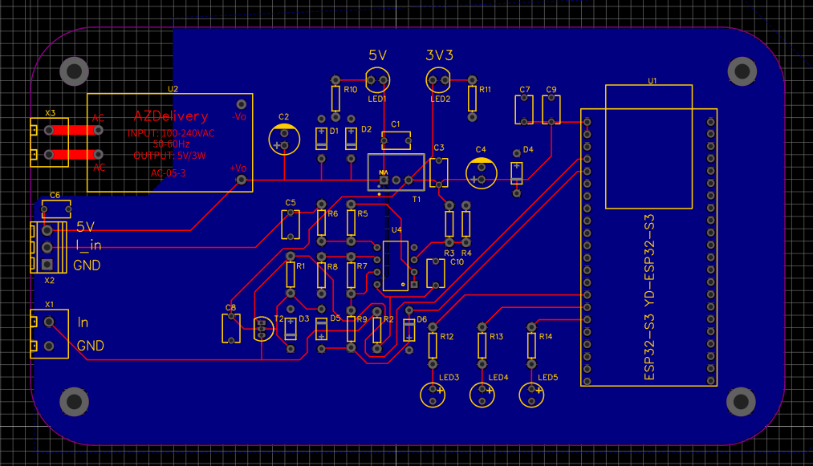
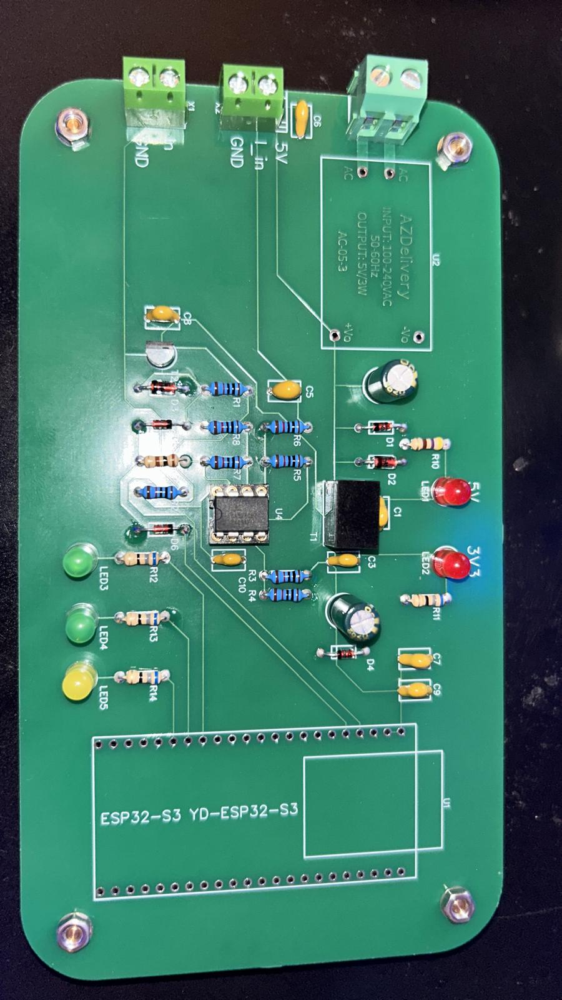
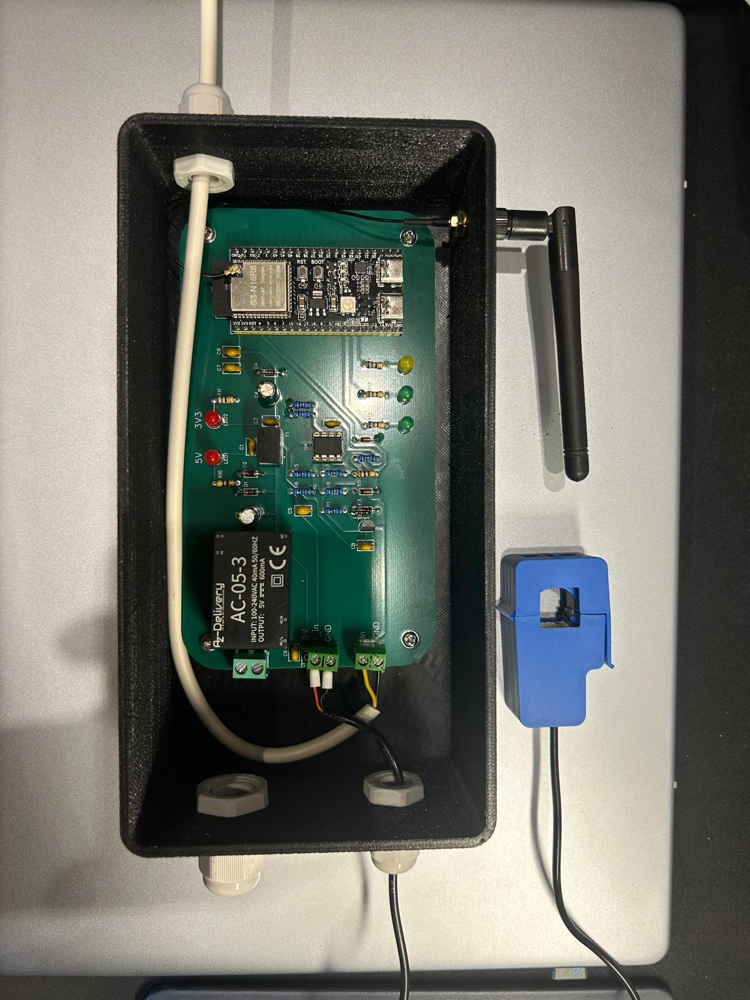
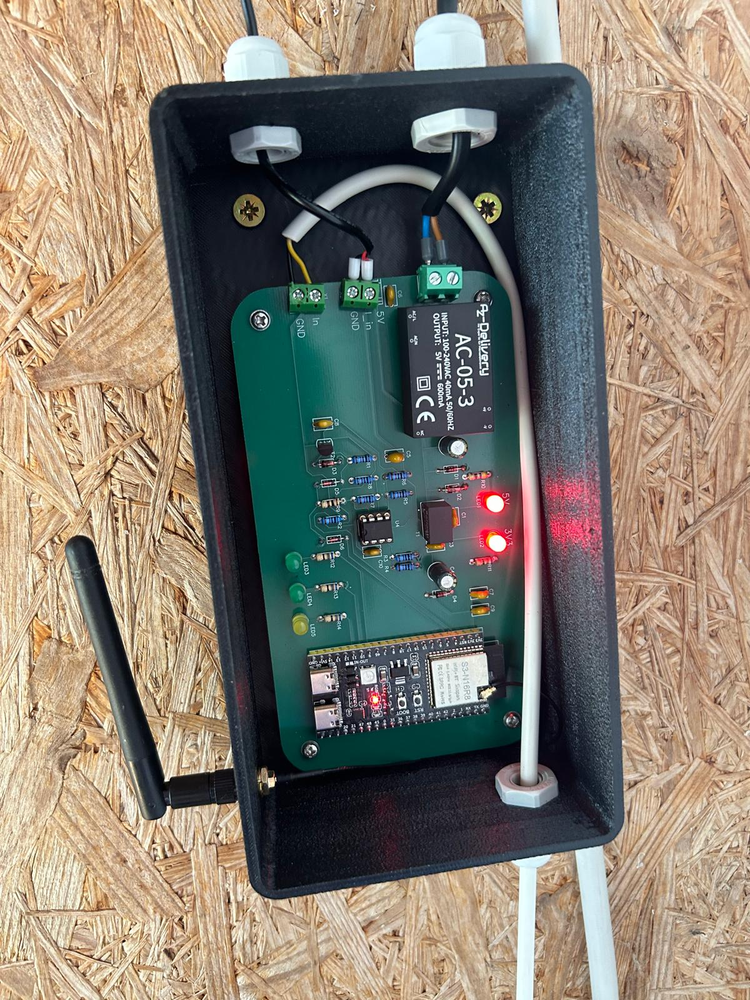
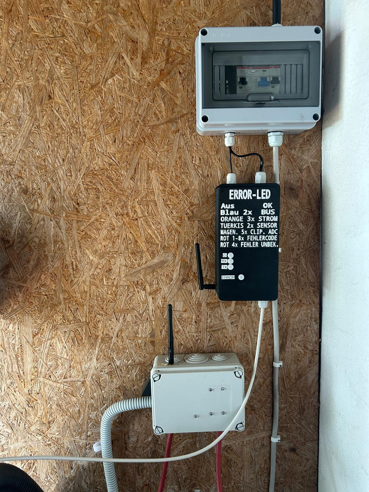

> **Documentation disclaimer:** AI was used to help write this documentation from the source code, hardware photographs and schematic.

# Heat_Pump — ESP32-S3 pool heat pump interface

This project connects a pool heat pump to a separate ESP-NOW bridge. An ESP32-S3 reads the heat pump's NET bus, measures current through a split-core current transformer and sends the operating state over the radio link. The bridge can switch the heat pump on or off, change its setpoint and select heating, cooling or automatic mode.

The heat pump retains its own temperature regulation. This firmware provides remote access, current monitoring, local indicators and a shutdown request when communication with the bridge is lost.

This controller is part of a larger pool control system and does not operate as a standalone system. Both the **PoolController** and the **heat pump controller** communicate with a central server through ESP-NOW and the bridge. The server coordinates the overall operation and sends the control commands; this firmware handles the heat pump interface, local monitoring and protection times.



## Features

- Read water temperature, setpoint, mode and power state from the NET bus.
- Measure RMS current and infer whether the compressor is running.
- Send telemetry once per second, including a 50-sample current waveform.
- Apply power, mode and temperature commands through the NET bus.
- Confirm changes against a subsequent configuration message from the heat pump.
- Enforce minimum on/off times for power-state changes.
- Show bus activity and diagnostic conditions through LEDs.

The bridge must support ESP-NOW and the shared `PoolWireProtocol`. This firmware does not include a web interface or MQTT client.

## Hardware and design files

The controller uses a custom carrier PCB with an ESP32-S3, an external antenna, current-signal conditioning, screw terminals and indicator LEDs. The photographs show an AZ-Delivery AC-05-3 power module rated at 5 V / 600 mA. The assembled board sits in a printed enclosure with cable glands.

The supplied hardware references are included here:

- [Circuit schematic (PDF)](docs/hardware/heat-pump-schematic.pdf)
- [PCB layout screenshot from eCAD (PNG)](docs/images/heat-pump-pcb-layout.png)

### Circuit schematic

[](docs/hardware/heat-pump-schematic.pdf)

Click the preview to open the full PDF.

### PCB layout



The schematic shows the 5 V power module, a K7803-500R3 3.3 V regulator, a 2N7000 bus level shifter and an LM358 current-conditioning circuit. The current input is biased from a 3.3 V resistor divider; the ADC path includes a series resistor and clamp diodes. The PDF and screenshot are reference exports. Editable CAD files and enclosure models are not included.

Current measurement is configured for an **SCT-013-030, 30 A / 1 V RMS**. The exact transformer model cannot be read from the photographs. A different sensor or conditioning circuit requires a matching conversion factor.

| Firmware connection | GPIO | Purpose |
| --- | ---: | --- |
| NET bus | 4 | Bidirectional single-wire communication |
| Current input | 5 | ADC1 analogue input |
| Status LED | 9 | Heat pump powered on or inferred compressor operation |
| RX LED | 10 | NET frame reception |
| TX LED | 11 | NET transmission activity |
| RGB fault LED | 48 | Onboard NeoPixel; configurable through `LED_PIN` |

Pin assignments are defined in [Pins.hpp](src/Config/Pins.hpp). The PCB LEDs labelled `5V` and `3V3` indicate supply voltage and are separate from the three GPIO-controlled indicators.

### Assembly photographs

| Carrier PCB during assembly | Open enclosure and current transformer |
| --- | --- |
|  |  |

| Wiring in the mounted enclosure | Installation overview |
| --- | --- |
|  |  |

The power module has a mains-voltage input. Work on that part of the assembly requires appropriate electrical expertise. Use the schematic to identify connections rather than relying on wire colours in the photographs. GPIO 4 connects to the level-shifted bus side, and the ADC requires a conditioned signal within its input range.

## How the firmware is organised

```text
Heat pump / NET bus <---> Heat pump controller <-- ESP-NOW --> Bridge <---> Server
                                  ^                             ^
                                  |                             |
                         Current transformer             ESP-NOW link
                               / ADC                            |
                                                         PoolController
```

Five FreeRTOS tasks divide the work. Raw frames, commands and results pass through queues with eight entries each. A mutex protects the shared heat pump state.

| Task | Responsibility | Core |
| --- | --- | ---: |
| `NetBusOwner` | Sole owner of bus access; receive frames and schedule transmissions | 0 |
| `NetProtocol` | Check frames, decode fields and update the shared state | 0 |
| `Current` | Sample current and calculate RMS and waveform data | 1 |
| `HPControl` | Process commands, readback, protection times and LEDs | 1 |
| `Comms` | Handle ESP-NOW, telemetry, acknowledgements and bridge monitoring | 1 |

## The NET bus

Reverse engineering the NET bus took a substantial amount of work. The interface needed more than a list of command bytes: pulse timing, bit order, checksums, temperature encoding, configuration fields and the reply window all had to be understood well enough to read the traffic and send changes that the heat pump would accept. The distinction between receiving a command, transmitting it and observing the resulting state is reflected throughout the firmware.

The description below documents the implementation in this repository. It is not a complete manufacturer protocol specification. Some frame types are recognised but their contents are not yet used, and no specific heat pump model is identified in the repository.

### Electrical interface

NET is a single-wire signal with a shared ground. In the supplied schematic, connector **X1** carries the bus signal and ground. A **2N7000 (T2)** connects the external bus side, pulled up to 5 V through **R2**, to `NET-Bus-3V3`, pulled up to 3.3 V through **R1**. Both pull-ups are 10 kΩ. The 3.3 V side connects to GPIO 4.

The firmware uses an open-drain-style drive: it asserts LOW by setting the output latch LOW and making the GPIO an output, then releases the line by switching the GPIO to a high-impedance input. It never actively drives HIGH. The pull-ups establish the HIGH level while the line is released. Receiving and transmitting share this GPIO, so only the bus-owner task accesses it.

### Pulse timing and bit order

Frames begin with a long LOW pulse followed by a HIGH pulse. Each data bit consists of a LOW interval and a HIGH interval; the length of the HIGH interval determines the bit value. Bits are packed **least significant bit first** within each byte.

| Signal interval | Accepted during reception | Generated during transmission |
| --- | --- | --- |
| Header LOW | 7–12 ms | 9 ms |
| Header HIGH | 4–6.5 ms | 5 ms |
| Data-bit LOW | 0.5–1.8 ms | 1 ms |
| Short data-bit HIGH | 0.6–1.7 ms → bit **1** | 1 ms → bit **0** |
| Long data-bit HIGH | 2.2–4.2 ms → bit **0** | 3 ms → bit **1** |
| Trailing LOW | End detection follows the received pulse sequence | 1 ms |
| Frame gap / idle HIGH | HIGH of at least 12 ms is treated as an end gap | Require 12 ms of continuous idle HIGH before sending |

**Receive and transmit bit mappings differ.** A long HIGH pulse represents 0 on reception and 1 on transmission. These are separate settings in [AppConfig.hpp](src/Config/AppConfig.hpp); using the receive mapping to generate a write frame would change the transmitted data.

Before sending, the firmware waits for an idle bus, with a 100 ms timeout. If the bus does not become idle, it aborts that attempt. Bus arbitration prevents the local receiver and transmitter from accessing the line at the same time.

### Frame lengths and checksums

The decoder accepts complete frames of **9 bytes / 72 bits** or **12 bytes / 96 bits**. Partial frames, overflow and incorrect checksums are rejected. All byte offsets below are zero-based.

| Frame length | Checksum rule |
| --- | --- |
| 12 bytes | `byte[11] = sum(byte[0] ... byte[10]) & 0xFF` |
| 9 bytes | `byte[8] = sum(byte[2] ... byte[7]) & 0xFF` |

For decoded 12-byte frames, byte 0 identifies the frame type and byte 1 must be `0xB1`.

| Frame | Current interpretation |
| --- | --- |
| `0xD1 / 0xB1` | Water temperature from byte 9 |
| `0x81 / 0xB1` | Power state, mode and mode-specific setpoint; retain the complete frame as a template for writes |
| `0xD2 / 0xB1` | Additional temperature fields printed only when NET debug is enabled |
| `0x82` through `0x86`, each `/ 0xB1` | Recognised without updating further state fields |
| Valid 9-byte frames | Count as bus contact without updating telemetry fields |

Decoded messages update only the fields they contain. A water-temperature message therefore preserves the last known setpoint and mode. Temperatures remain `NaN` until first decoded. A checksum-valid frame can refresh the bus-contact timestamp even when it does not provide new configuration data; write commands require a recent configuration frame as well.

### Configuration and temperature encoding

In the `0x81 / 0xB1` configuration frame, byte 2 contains the power and mode bits:

| Field | Encoding |
| --- | --- |
| Power | Byte 2, bit 0: 1 = on, 0 = off |
| Mode | Byte 2, bit 5 selects Auto; otherwise bit 4 selects Heat; neither selects Cool |
| Cooling setpoint | Byte 3 |
| Heating setpoint | Byte 4 |
| Automatic-mode setpoint | Byte 5 |

Temperature decoding uses bits 1–5 for the integer value, bit 0 for an additional 0.5 °C, bit 6 for an additional 2 °C, and bit 7 to negate the result. The write path accepts setpoints from **5 to 33.5 °C** and rounds them to half-degree steps. It uses the encoding with bit 6 set and changes only the setpoint byte for the currently selected mode.

### Sending a change and checking the result

1. Require a valid `0x81 / 0xB1` configuration and bus contact no older than ten seconds.
2. Copy that configuration, change the requested field and recalculate the checksum. Preserve the remaining bytes.
3. Wait for a valid 12-byte frame with subtype `0xB1` to establish a reply window.
4. Schedule the write header roughly **100 ms after the received frame ends**, allowing for the 12 ms idle check. Keep at least one second between a completed transmission and the next transmission.
5. Check a subsequent `0x81 / 0xB1` message for the requested field value before reporting success.

A TX event alone does not show that the heat pump accepted the change. Readback is what completes the command. If the requested value is already present and the bus state is current, the command can be confirmed without another write.

Power commands are retried at intervals of at least one second while waiting for confirmation. Mode and setpoint commands do not use these retries. The confirmation timeout is twelve seconds from the first successful transmission; a normal command's validity deadline can expire sooner. The firmware matches the requested field rather than requiring every byte of the returned configuration to equal the transmitted frame.

## Current measurement

Each measurement contains 256 samples at a target rate of 2 kHz, covering roughly 128 ms. The firmware removes the DC bias and calculates the AC RMS value, then scales it by 30 A per volt RMS. It waits 500 ms after each measurement, so the full measurement interval is about 628 ms plus processing overhead.

Values below 0.25 A are set to zero as noise. Current above 0.7 A sets `compressorRunning`. This is an inference from current rather than an independent compressor-state report. The project does not calculate electrical power or energy consumption.

ADC conversion assumes 3.3 V and 12-bit resolution. The transformer, conditioning circuit and conversion factor must agree with the actual assembly. Samples close to either ADC limit raise the clipping flag. The transmitted waveform contains 50 points selected from the measurement block.

## ESP-NOW and remote commands

The radio operates in station mode on **channel 1**, without connecting to a WLAN router. At startup the node broadcasts a discovery message. Discovery, pairing and suitable incoming messages establish the bridge's MAC address, which is retained in RAM. ESP-NOW peers are unencrypted in the current implementation.

The node uses `NodeId::HeatPump` and expects messages from `NodeId::EspNowBridge`. Before a peer is known, telemetry is broadcast. Afterwards, telemetry and acknowledgements are sent directly to the bridge. Both devices need the same channel and compatible versions of `PoolWireProtocol`.

| Command | Behaviour |
| --- | --- |
| `Power` | Change power state when the protection time permits |
| `Setpoint` | Set the temperature for the current mode, from 5 to 33.5 °C in half-degree steps |
| `Mode` | Select Heat, Cool or Auto |
| `RequestStatus` | Check for current bus and configuration data; periodic telemetry runs independently |

`ReceivedByNode` acknowledges reception. `AppliedLocally` reports completion after matching readback, or immediately when the requested state is already present. Command IDs and sequence numbers allow duplicate or superseded commands to be recognised.

## Protection times and connection loss

Defaults are defined in [AppConfig.hpp](src/Config/AppConfig.hpp):

| Setting | Default |
| --- | ---: |
| Minimum time powered on | 180 s |
| Minimum time powered off | 180 s |
| Maximum bus/configuration age for writes | 10 s |
| Bridge timeout | 10 s |
| Command confirmation timeout | 12 s |
| Startup grace for bus/sensor outage diagnostics | 15 s |
| Current measurement becomes stale after | 3 s |
| Low-current diagnosis while powered on | Below 0.5 A for 20 s |

Protection times follow the **reported heat pump power state**, rather than measured compressor operation. Timing starts with the first observed state and restarts when that state changes. A normal power command issued too early is rejected rather than held until the protection time expires.

After ten seconds without valid bridge contact, the watchdog requests a shutdown. Pending commands are ended and queued normal commands are discarded. The shutdown request also observes the minimum on-time and needs current configuration data and a working NET bus. It remains pending until off is confirmed or already observed, and the watchdog requests it periodically while the bridge remains unavailable.

This is not an immediate emergency stop. Reconnection does not automatically issue a power-on command. Other diagnostic faults drive the fault indicator but do not independently request shutdown in the current controller.

## LEDs and troubleshooting

The status LED is on when the heat pump reports power on or the measured current suggests compressor operation. RX lights for about 20 ms after frame reception; TX lights for about 50 ms after a transmission attempt.

| RGB fault indicator | Meaning |
| --- | --- |
| Off | No currently detected diagnostic fault |
| Blue, 2 flashes | No recent NET bus contact |
| Orange, 3 flashes | Power is reported on, but current stays below 0.5 A for at least 20 s |
| Cyan, 2 longer flashes | Current measurement is missing or older than 3 s |
| Magenta, 5 quick flashes | ADC samples reach the measurement limits |
| Red, 1–8 flashes | Reported error code 1–8 |
| Red, 4 flashes | Active error with code 0 or a code outside 1–8 |

The red patterns are implemented in the LED module, but **the current NET decoder does not populate heat pump error codes**. Those patterns are not yet backed by bus error decoding. When several faults are present, only the highest-priority one is shown: heat pump error, clipping, stale current measurement, low current, then missing bus contact.

Use the serial monitor at 115200 baud. Log categories are `GENERAL`, `NET`, `PROTO`, `CURRENT`, `CONTROL` and `COMMS`.

- **No RX activity:** Check the bus connection, shared ground, level shifter and GPIO assignment.
- **Rejected commands:** Check protection times, configuration age and command validity.
- **TX without confirmation:** Check reply timing and the subsequent `0x81 / 0xB1` readback. TX alone is not an acceptance indication.
- **No radio contact:** Check channel 1 on both devices, discovery/pairing and bridge `NodeStatus` messages.
- **Orange or magenta indication:** Check actual operation, sensor wiring, ADC bias and scaling. The heat pump may legitimately be powered on while its own controller keeps the compressor stopped.

For additional logs, set `HEAT_PUMP_ENABLE_NET_DEBUG`, `HEAT_PUMP_ENABLE_COMMAND_DEBUG` or `HEAT_PUMP_ENABLE_ESPNOW_DEBUG` to `1`. Also set `HEAT_PUMP_LOG_LEVEL=3` to allow debug output from the project's logger. PlatformIO's `CORE_DEBUG_LEVEL` controls framework logging separately.

## Build and flash

The project uses PlatformIO, the Arduino framework and C++17. The selected board is `esp32-s3-devkitc-1`. Dependencies are Adafruit NeoPixel and the local `PoolWireProtocol` library. PlatformIO references the latter through `symlink://../PoolWireProtocol`, so it must be located next to this project:

```text
Projects/
├── Heat_Pump/
│   ├── platformio.ini
│   └── src/
└── PoolWireProtocol/
    ├── library.json
    └── src/
```

Run from the project directory:

```powershell
pio run -e esp32-s3-devkitc-1
pio run -e esp32-s3-devkitc-1 -t upload
pio device monitor -b 115200
```

Build, Upload and Monitor are also available through the PlatformIO extension in VS Code. Upload speed is configured as 921600 baud, with USB CDC enabled at boot. Startup logs report the ESP-NOW MAC address and channel. The ten-second bridge-loss shutdown request also applies on initial startup if no bridge is reachable.

## Tests

[HeatPumpLogicTests.cpp](test/HeatPumpLogicTests.cpp) exercises the logic without an ESP32: checksums and lengths, partial state updates, configuration changes, transmission settings, bus arbitration, protection times including timer wraparound, and bridge-watchdog behaviour. Small stubs replace Arduino and logging.

With `g++` available, run in PowerShell:

```powershell
New-Item -ItemType Directory -Force .pio/host-tests | Out-Null
g++ -std=c++17 -Itest/stubs -Isrc -I../PoolWireProtocol/src `
  test/HeatPumpLogicTests.cpp test/LoggerStub.cpp `
  src/HeatPump/NetProtocol.cpp src/HeatPump/NetConfiguration.cpp `
  src/HeatPump/HeatPumpData.cpp src/HeatPump/NetBusArbiter.cpp `
  src/HeatPump/PowerCycleGuard.cpp src/HeatPump/BridgeWatchdog.cpp `
  -o .pio/host-tests/HeatPumpLogicTests.exe
& ./.pio/host-tests/HeatPumpLogicTests.exe
```

These tests do not validate electrical bus waveforms, radio range, ADC accuracy or the behaviour of the connected heat pump.

## Source and documentation map

| Path | Contents |
| --- | --- |
| `src/main.cpp` | Initialisation, queues and FreeRTOS tasks |
| `src/Config/` | Pins, timing, thresholds and radio settings |
| `src/HeatPump/` | NET bus, decoder, state, command handling and protection logic |
| `src/CurrentSensor/` | ADC sampling, RMS current and waveform |
| `src/Communication/` | ESP-NOW and PoolWireProtocol integration |
| `src/Led/` | Activity indicators and RGB fault patterns |
| `src/Logger/` | Serial logging |
| `test/` | Host tests and stubs |
| `docs/hardware/` | Circuit schematic PDF |
| `docs/images/` | Selected hardware photographs and eCAD layout screenshot |

The bus timings and decoded fields describe this particular implementation. Compatibility with another heat pump must be checked against that device's bus traffic and electrical interface.
